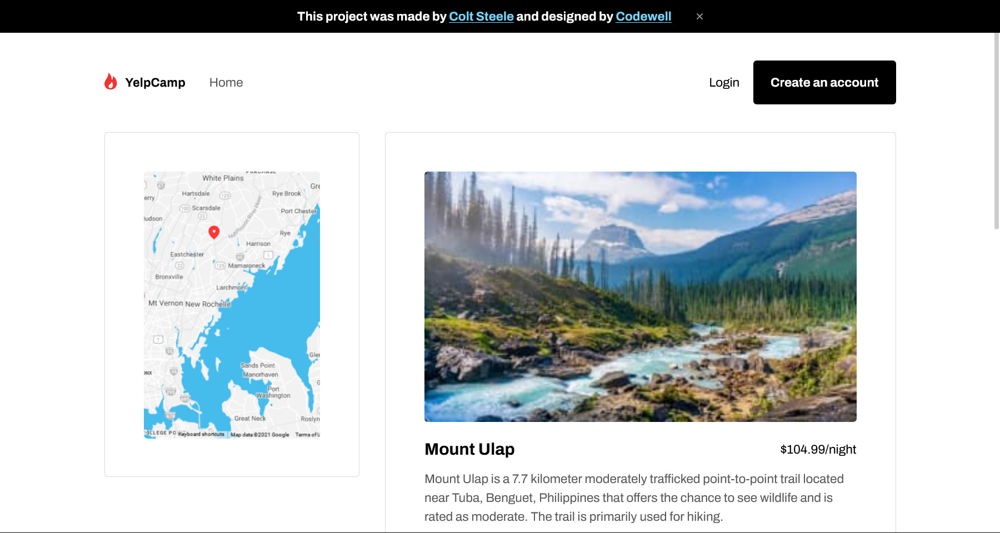

# YelpCamp-Redesigned

A static and completely responsive website of the famous YelpCamp by Colt Steele, completely redesigned by [Codewell](https://www.codewell.cc/challenges/yelpcamp-by-colt-steele--6144c7c8a383e41090a3d84b) and implemented by me as a Frontend Challenge.

### Table Of Contents

- [YelpCamp-Redesigned](#yelp-camp-redesigned)
   - [Table Of Contents](#table-of-contents)
   - [About](#about)
   - [User Journey](#user-journey)
   - [Technologies Used](#technologies-used)
   - [Author](#author)
   
## About

YelpCamp is a website where users can create and review campgrounds. In order to review or create a campground, you must have an account. This project was part of Colt Steele's web dev course on udemy.

The Project is currently hosted at this [Link](https://nishtha131201.github.io/YelpCamp-Redesigned/) 

## User Journey

*Home Page*

*View Campgrounds*

*SignIn/SignUp Page*

*Add New Campground(By Admin) or new Comment(By User)*

*Campground Page*

## Technologies Used

- HTML
- CSS
- Javascript

## Author
### [Nishtha Rathod](https://github.com/Nishtha131201)

